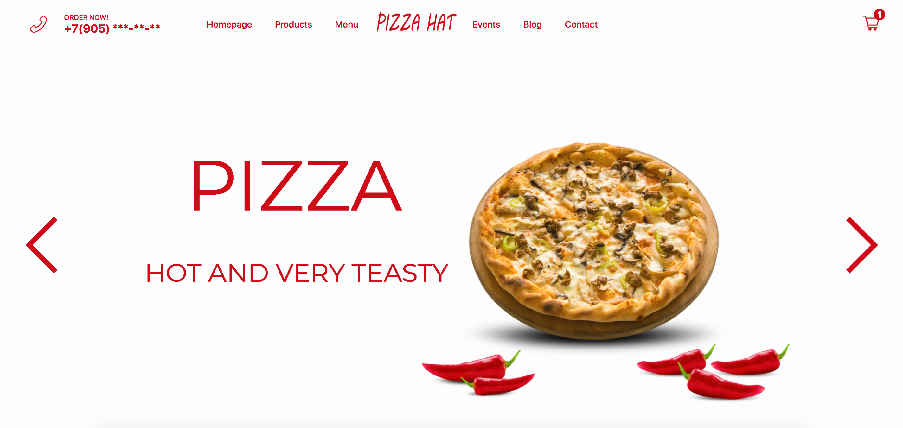
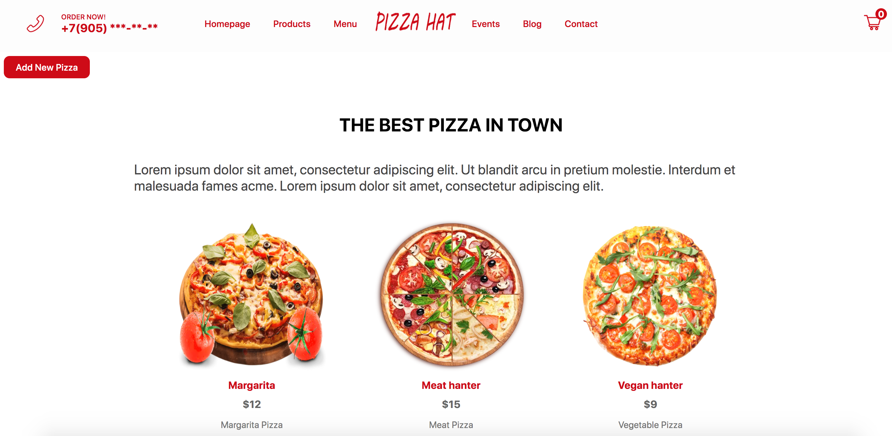
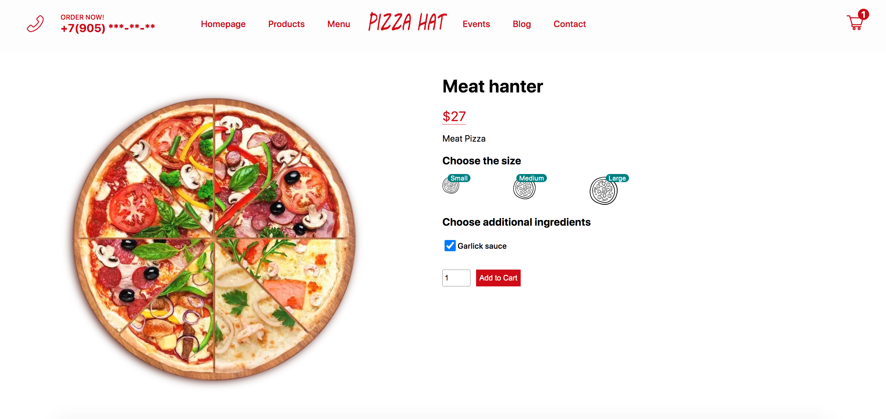
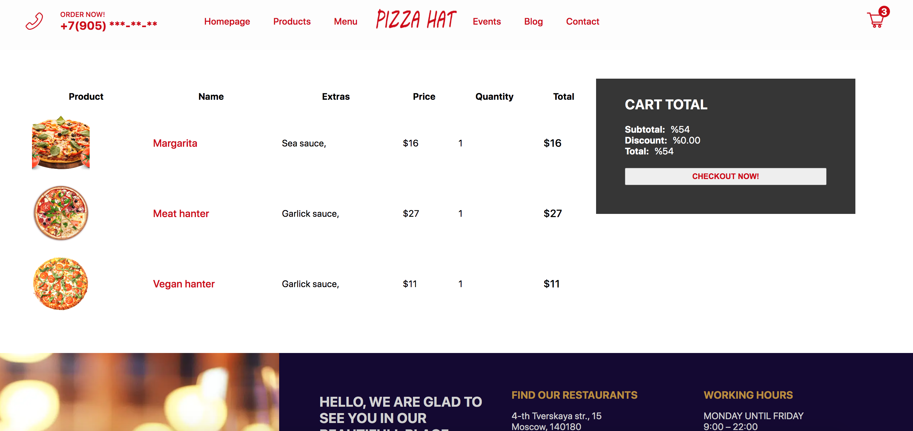
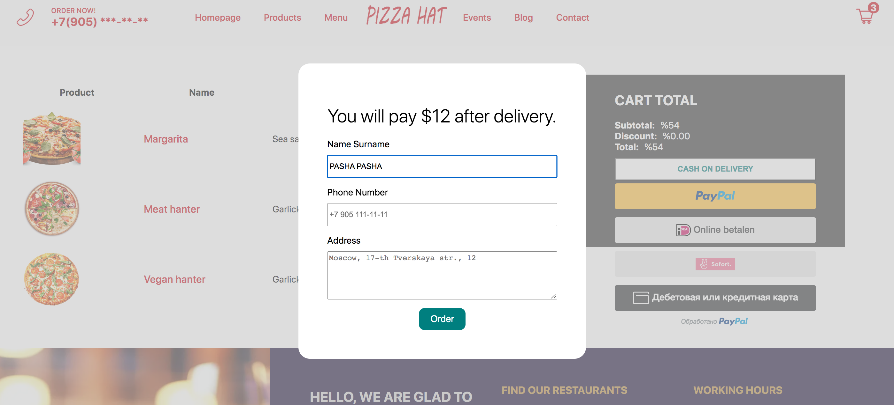
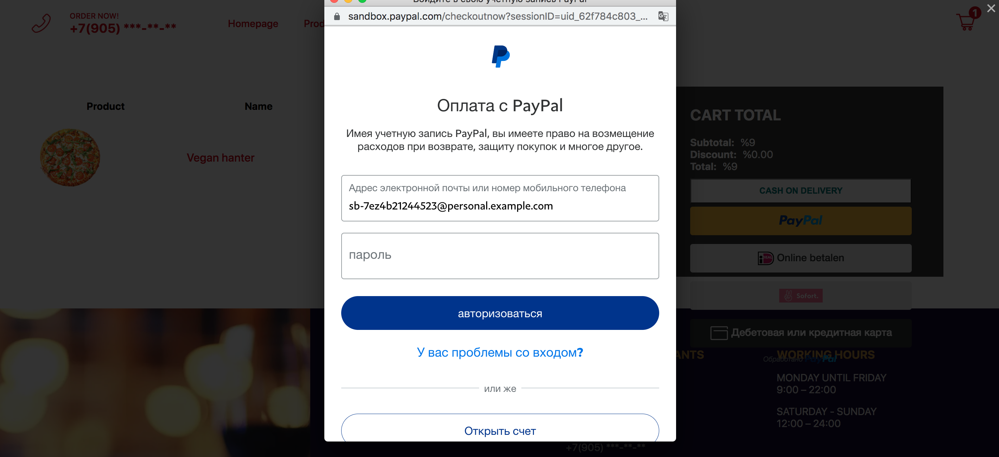
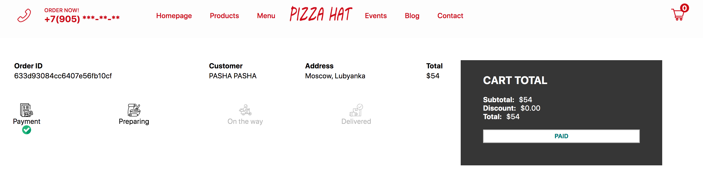
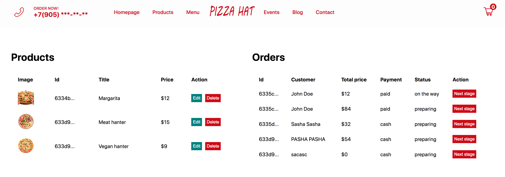
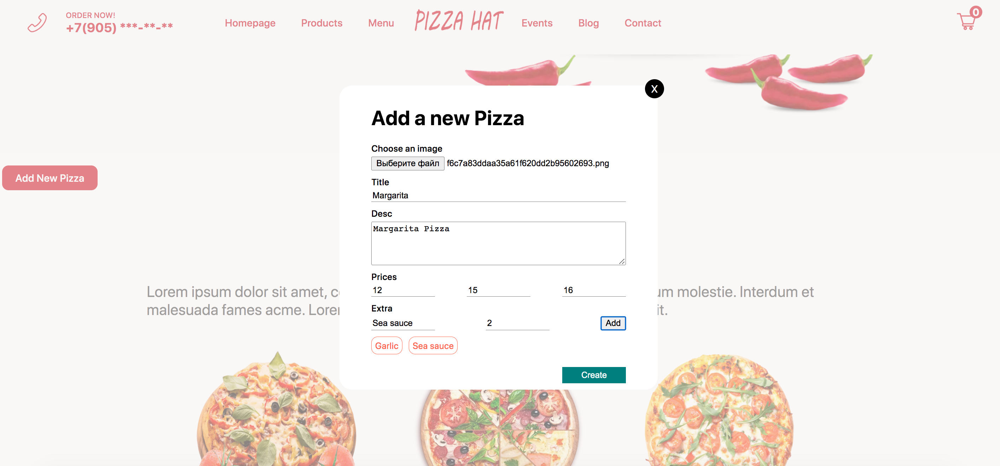

# Pizza E-com Shop
Commercial development
____
### Technology stack: React, Next.js, Redux toolkit, Node.js, MongoDB, axios
___
### start:
npm run dev
___
Pizza shop with:
1. Admin panel
2. Admin login pages
3. Payment functionality (Paypal)
4. Basket page
5. Product cart page.
6. API (MongoDB)

___

# Screans:

### Main page:

### Product page:

### Order & Payment:

### Admin panel:

___
##
Not full application becouse I can't send full. Only for your understanding.
